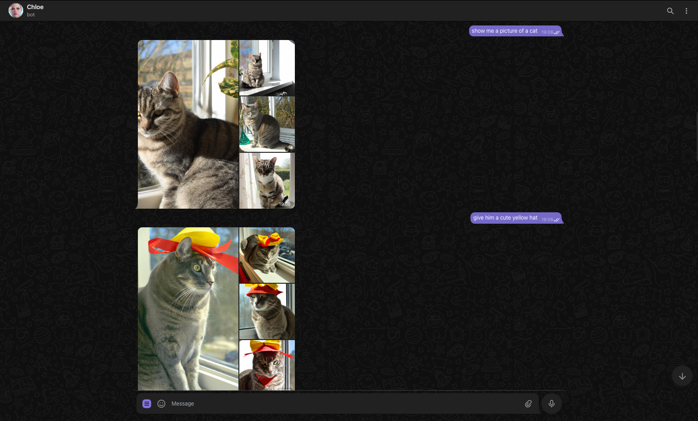
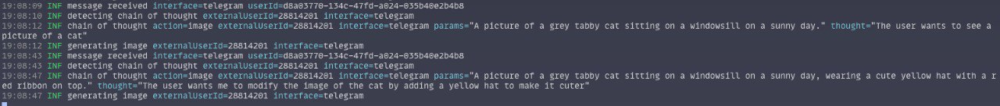
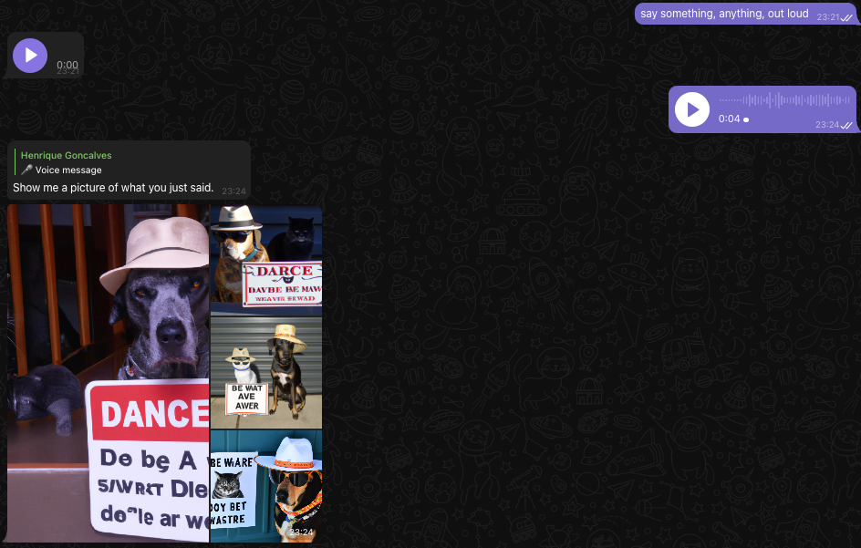

# Telegram

Chloe can be used as a Telegram bot. To use it, you need to create a bot using
the [BotFather](https://t.me/botfather) and set the `CHLOE_TELEGRAM_TOKEN` environment variable to
the
token provided by the BotFather.

1. Start a conversation with your bot
2. Just chat.

Chloe should automatically detect what you want to do and respond accordingly, including
images and voice messages. You can also send voice messages, and it will convert them to text and
respond accordingly.

## Support

| **Feature**      | **Supported** |
|------------------|---------------|
| Completion       | Yes           |
| Image Generation | Yes           |
| Text-to-Speech   | Yes           |
| Transcription    | Yes           |

## Commands

The following commands are available:

- **/forget** - Wipe all context and reset the conversation with the bot
- **/generate** - Generate an image using DALL-E
- **/tts** - Converts text to speech
- **/action** - Performs an action

## Configuration

| Environment Variable                   | Default Value   | Description                                                                                                                                            | Options            |
|----------------------------------------|-----------------|--------------------------------------------------------------------------------------------------------------------------------------------------------|--------------------|
| CHLOE_TELEGRAM_TOKEN                   |                 | Telegram bot token                                                                                                                                     |                    |
| CHLOE_TELEGRAM_IMAGE_COUNT             | 4               | Number of images to generate when the user asks for an image                                                                                           | Between 1 and 10   |
| CHLOE_TELEGRAM_STREAM_MESSAGES         | false           | Whether to stream messages as they are generated (not recommended)                                                                                     | true false     |
| CHLOE_TELEGRAM_STREAM_FLUSH_INTERVAL   | 500ms           | Interval between flushing the stream buffer                                                                                                            |                    |
| CHLOE_TELEGRAM_SEND_PROCESSING_MESSAGE | false           | Whether to send a processing message placeholder while the bot is generating it's response, defaults to true if CHLOE_TELEGRAM_STREAM_MESSAGES is true | true false     |
| CHLOE_TELEGRAM_PROCESSING_MESSAGE      | ↻ Processing... | Message to send as a placeholder while the bot is generating it's response                                                                             |                    |
| CHLOE_TELEGRAM_MAX_MESSAGE_LENGTH      | 4096            | Maximum length of a message                                                                                                                            | Between 1 and 4096 |

## Examples

Here, Chloe understands that I want an image of a cat and responds with one. It also understands
when I ask it to give the cat a cute yellow hat, and it preserves the context of the previous image.

You can see how Chloe reasons about the context and understands what I want to do.

Here, Chloe says "Beware of the dog, the cat is shady too". I then ask (in a voice message) for it
to show me a picture of what she just said, and she generates relevant images.

